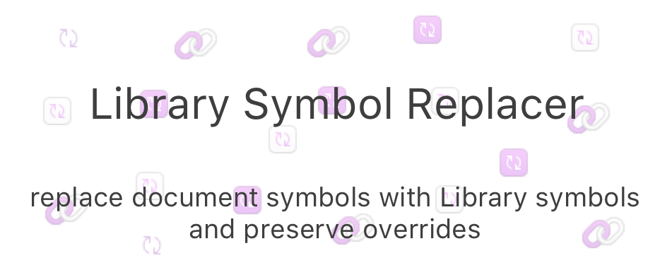

## Overview
Replace symbols in the current document with symbols from a Library.

Sketch 47 sees the introduction of Libraries, but migrating existing files to use Library symbols is one of the first big headaches. This plugin aims to help with that.

## Installation

[Download zip](https://github.com/zeroheight/library-symbol-replacer/releases/download/1.0.1/library-symbol-replacer.sketchplugin.zip)

## Usage
### Preparing Libraries
* copy-and-paste your symbols into a different Sketch document
* make that document a Library ([see Sketch docs if you need help](https://www.sketchapp.com/docs/libraries/adding-libraries))

### Using the plugin
* open the document where you want to replace symbols with Library symbols
* run the plugin
* select the Library file using the "Choose" dialog
* the plugin will tell you what replacements it thinks it can make
* when the replacements are done, it will also ask you if you want to delete the symbols which have been replaced

## Help!
Get in touch with me at robin#zeroheight.com, but use @ instead of # if you're not a 🤖
